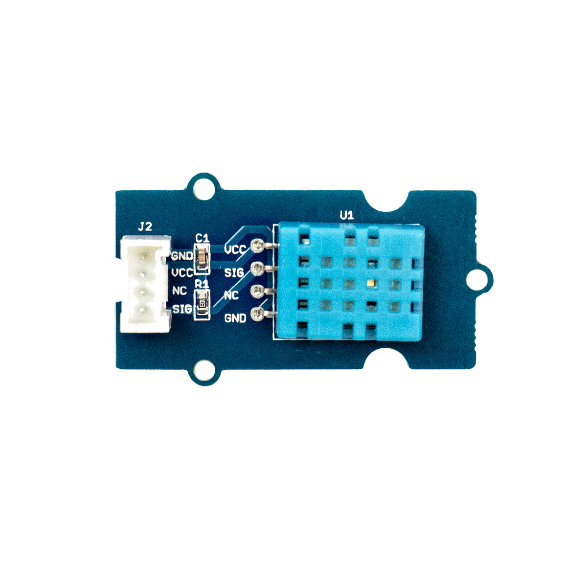

# Temperatur- und Luft­feuchtigkeits&amp;shy;sensor

## Beschreibung
Der Temperatur- und Luftfeuchtigkeitssensor kann zum Messen der Temperatur und der relativen Luftfeuchtigkeit in seiner direkten Umgebung eingesetzt werden. Der Sensor ist vom Hersteller so voreingestellt, dass die Messdaten als sauberes, digitales Signal ausgegeben werden. Das heißt, dass es dabei keine Messschwankungen oder Messfehler gibt, ein unverfälschtes Messsignal also. Dadurch besitzt der Sensor eine hohe Präzision, Zuverlässigkeit und Langzeitstabilität. Zusätzlich sind auch lange Kabel (>20 m) als Datenübertragung zwischen Sensor und Mikrocontroller kein Problem. Der Sensor arbeitet allerdings nur bei Umgebungstemperaturen über 0 °C.

Der Sensor kann direkt oder mithilfe des Grove Shields an einen Arduino oder Raspberry Pi angeschlossen werden. Der Sensor kommuniziert über einen digitalen Pin.

Das Modul wird beispielsweise in einer Messstation für Umweltdaten, wie Feinstaub, Lautstärke, Luftfeuchtigkeit, Temperatur und UV-Strahlung eingesetzt.

Alle weiteren Hintergrundinformationen sowie ein Beispielaufbau und alle notwendigen Programmbibliotheken sind auf dem offiziellen Wiki (bisher nur in englischer Sprache) von Seeed Studio zusammengefasst. Zusätzlich findet man über alle gängigen Suchmaschinen durch die Eingabe der genauen Komponentenbezeichnung entsprechende Projektbeispiele und Tutorials.

 

**Wichtige Hinweise:**

Die unten aufgeführte Anleitung zur Nutzung des Luftfeuchtigkeitssensors funktioniert gleichermaßen mit verschiedenen Sensoren. Damit der Beispielcode mit dem Luftfeuchtigkeitssensor funktioniert, muss der entsprechende Sensorname im Code ein- oder auskommentiert werden. Ist der Sensor vom Typ DHT 11, so müssen die drei entsprechenden Zeilen wie folgt aussehen: #define DHTTYPE DHT11   // DHT 11 //#define DHTTYPE DHT22   // DHT 22 (AM2302), AM2321 //#define DHTTYPE DHT21   // DHT 21 (AM2301)

Wenn der Sensor vom Typ DHT 22 ist, lautet der Code:

//#define DHTTYPE DHT11   // DHT 11 #define DHTTYPE DHT22   // DHT 22 (AM2302), AM2321 //#define DHTTYPE DHT21   // DHT 21 (AM2301)

## Beispiele

!!!show-examples:./examples/

<!-- infolist -->

@[youtube](https://www.youtube.com/watch?v=UlptibF4bUk)

 

## Wichtige Links für die ersten Schritte:

- [Seeed Studio Wiki – Temperatur- und Luftfeuchtigkeitssensor](http://wiki.seeedstudio.com/Grove-TemperatureAndHumidity_Sensor/)

## Projektbeispiele:

- [Simple Projects – DHT11 mit 1602 LCD](https://simple-circuit.com/arduino-grove-dht11-sensor-1602-lcd/)

## Weiterführende Hintergrundinformationen:

- [I2C - Wikipedia Artikel](https://de.wikipedia.org/wiki/I%C2%B2C)
- [SPI - Wikipedia Artikel](https://de.wikipedia.org/wiki/Serial_Peripheral_Interface)
- [UART - Wikipedia Artikel](https://de.wikipedia.org/wiki/Universal_Asynchronous_Receiver_Transmitter)
- [Luftfeuchtigkeit – Wikipedia Artikel](https://de.wikipedia.org/wiki/Luftfeuchtigkeit#Relative_Luftfeuchtigkeit)
- [GitHub-Repository: Temperatur- und Luftfeuchtigkeitssenso](https://github.com/MakeYourSchool/5-Temperatur-und-Luftfeuchtigkeitssensor)

